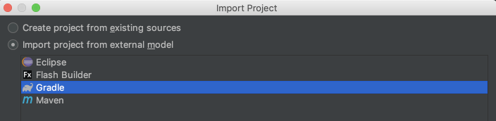
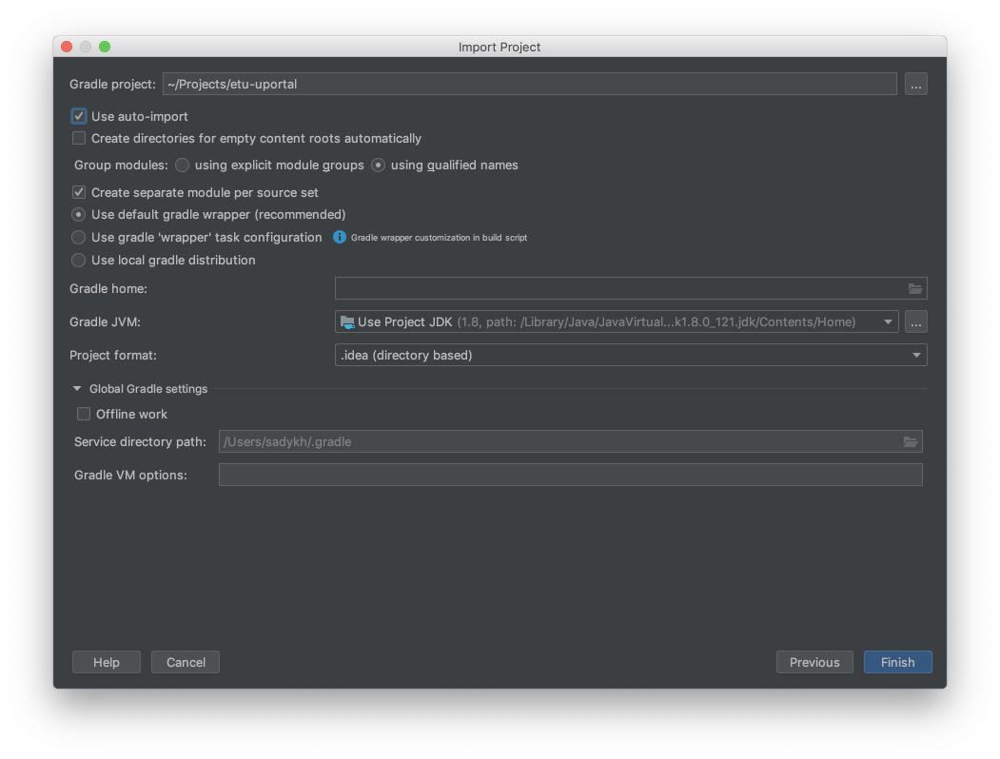

# Импорт проекта в IntelliJ IDEA

К данному момент предполагается, что вы уже склонировали репозиторий. Вам нужно выбрать Files => New => Project from existing sources.

Далее:
1. Выбрать папку с репозиторием
2. Выбрать external model: gradle
3. Нажать далее и выбрать use auto-import.
4. ...
5. Profit!

Запуск (run application) сам подтянется и будет доступен для запуска.

Скришоты для тех, у кого все еще не получилось, ниже:

Пункт 2:

Пункт 3:

